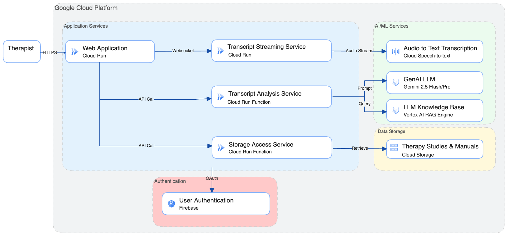

# Ther-Assist: Real-time Therapy Guidance System

Ther-Assist is a generative AI multimodal tool designed to help psychotherapists deliver personalized, evidence-based treatments (EBTs) for anxiety and depression. It provides real-time feedback to help assess patients, guide treatment decision-making, and evaluate progress.

## Overview

Ther-Assist listens ambiently to therapy sessions and provides near real-time guidance based on evidence-based treatment manuals and protocols. The system uses Google Cloud services and Gemini 2.5 Flash to analyze therapy conversations and suggest interventions, pathway changes, and therapeutic techniques.

## Features

- **Real-time Transcription**: Ambient listening with speaker diarization (therapist vs patient)
- **Live Analysis**: Continuous analysis of therapy segments with EBT-based recommendations
- **Critical Alerts**: Immediate notifications for safety concerns or important pathway changes
- **Session Metrics**: Track engagement, therapeutic alliance, and emotional states
- **Evidence-Based Guidance**: References to specific manual sections and treatment protocols
- **Pathway Monitoring**: Suggests alternative approaches when current methods aren't effective

## Architecture

### Diagram


### Frontend (React + Vite)
- **Clinician-Optimized UI**: Large, readable alerts with visual priority system
- **Live Transcript Display**: Real-time speaker-labeled conversation
- **Alert System**: Critical (red), Suggestion (yellow), Info (green) alerts
- **Session Metrics Dashboard**: Visual indicators for therapeutic progress

### Backend Services
1. **Streaming Transcription Service** (`backend/streaming-transcription-service/`)
   - FastAPI WebSocket service deployed on Cloud Run
   - Uses Google Cloud Speech-to-Text V2 API
   - Real-time audio streaming with low latency
   - Optimized for therapy conversations

2. **Therapy Analysis Service** (`backend/therapy-analysis-function/`)
   - Uses Gemini 2.5 Flash with thinking mode
   - RAG integration with EBT corpus
   - Provides real-time therapeutic guidance
   - Generates session summaries

## Deployment Instructions

### Prerequisites
- Node.js 18+ and npm
- Google Cloud Project with billing enabled
- Google Cloud CLI (`gcloud`) installed and authenticated

### Environment Configuration

Each service requires environment variables for authorization:

**Backend Services**: Copy `.env.example` to `.env` in each backend service directory and configure all variables

**Frontend**: Copy `.env.example` to `.env` and `.env.development` and update all variables.

### GCP & Firebase Setup

1. Enable APIs
```bash
# Set your project ID
export PROJECT_ID="your-project-id"
gcloud init
gcloud auth application-default login

# Enable required APIs
gcloud services enable speech.googleapis.com
gcloud services enable aiplatform.googleapis.com
gcloud services enable discoveryengine.googleapis.com
gcloud services enable generativelanguage.googleapis.com
gcloud services enable artifactregistry.googleapis.com
gcloud services enable cloudbuild.googleapis.com
gcloud services enable run.googleapis.com
gcloud services enable cloudfunctions.googleapis.com
gcloud services enable compute.googleapis.com
gcloud services enable storage.googleapis.com
```

2. Enable Firebase Authentication
- Search for Firebase in your GCP project. Click into Firebase Authenticaiton, and click into the Firebase Portal
- Enable Google Authentication within Firebase
- Go to your project settings, enable a web application, and grab the Firebase config object. It should look like this:
```javascript
{
  apiKey: "api-key",
  authDomain: "your-gcp-project.firebaseapp.com",
  projectId: "your-gcp-project",
  storageBucket: "your-gcp-project.firebasestorage.app",
  messagingSenderId: "message-sender-id",
  appId: "1:app-id"
}
```

3. Create RAG Corpuses
Follow the instructions in the [RAG README.MD](./setup_services/rag/README)

3. Backend Deployments
- Deploy Therapy Analysis Function
```bash
cd ../therapy-analysis-function
gcloud functions deploy therapy_analysis \
  --runtime python312 \
  --trigger-http \
  --allow-unauthenticated \
  --memory 1GB \
  --timeout 540s \
  --set-env-vars GOOGLE_CLOUD_PROJECT=$PROJECT_ID
```
- Deploy Storage Access Function
```bash
cd ../storage-access-function
export PROJECT_ID="your-project-id"
./deploy.sh
```
- Deploy Streaming Transcription Service
```bash
cd backend/streaming-transcription-service
export PROJECT_ID="your-project-id"
./deploy.sh
```

4. Frontend Deployment
- Install dependencies
```bash
cd frontend

# Copy environment variables and update with your own
cp .env.example .env
```
- Update your .env file with your project's variables
- Use your firebase config object to create `frontend/firebase-config-object.ts`:
```javascript
export const firebaseConfig = {
  apiKey: "api-key",
  authDomain: "your-gcp-project.firebaseapp.com",
  projectId: "your-gcp-project",
  storageBucket: "your-gcp-project.firebasestorage.app",
  messagingSenderId: "message-sender-id",
  appId: "1:app-id"
};
```
- Create the following file `frontend/firebaserc` with your own information:
```javascript
{
  "projects": {
    "default": "your-gcp-project-id"
  }
}
```
- Build your app
```bash
npm run build
```
- Deploy to Firebase
```bash
firebase deploy
```
- Go back to Firebase settings and allowlist authentication for every single domain in the backend and for your frontend domain

## Local Dev

### Frontend
1. Create .env.development
```bash
# Backend API endpoints
VITE_ANALYSIS_API=http://localhost:8080
VITE_STORAGE_ACCESS_API=http://localhost:8081
VITE_TRANSCRIPTION_WS=ws://localhost:8082

# Google Cloud settings
VITE_GOOGLE_CLOUD_PROJECT=your-gcp-project
```

2. Install dependencies and run frontend
```bash
cd frontend
npm install
npm run dev
```

### Backend therapy-analysis-function
1. Navigate to the directory
```bash
cd backend/therapy-analysis-function
```
2. Configure your venv & install dependencies
```bash
python3 -m venv .venv
source .venv/bin/activate
pip install -r requirements.txt
```
3. Run the Cloud Run Function locally
```bash
functions-framework --target=therapy_analysis --port=8080
```

### Backend storage-access-function
1. Navigate to the directory
```bash
cd backend/storage-access-function
```
2. Configure your venv & install dependencies
```bash
python3 -m venv .venv
source .venv/bin/activate
pip install -r requirements.txt
```
3. Run the Cloud Function locally
```bash
functions-framework --target=storage_access --port=8081
```

### Backend streaming-transcription-service
1. Navigate to the directory
```bash
cd backend/streaming-transcription-service
```
2. Configure your venv & install dependencies
```bash
python3 -m venv .venv
source .venv/bin/activate
pip install -r requirements.txt
```
3. Run the service locally
```bash
python main.py
```

## Usage

1. **Start Session**: Click "Start Session" to begin recording
2. **Real-time Monitoring**: Watch the transcript and guidance panels
3. **Critical Alerts**: Respond to red alerts immediately
4. **Pathway Changes**: Consider yellow suggestions for approach modifications
5. **End Session**: Click "End Session" to stop recording and generate summary

## EBT Corpus

Place evidence-based treatment manuals in `backend/rag/corpus/`:
- CBT manuals
- PE (Prolonged Exposure) protocols
- Social phobia treatment guides
- Other EBT resources

## Security & Privacy

- All audio processing happens in memory
- Sessions are not stored by default
- HIPAA compliance considerations:
  - Deploy in HIPAA-compliant GCP region
  - Enable VPC Service Controls
  - Use Customer-Managed Encryption Keys (CMEK)
  - Implement proper access controls

## Development

### Local Development

For local development without Google Cloud:

1. Use mock services in `frontend/services/mockServices.ts`
2. Test with pre-recorded audio files
3. Use sample transcripts for UI development

## Contributing

1. Fork the repository
2. Create a feature branch
3. Make your changes
4. Add tests
5. Submit a pull request

## License

This project is licensed under the MIT License - see LICENSE file for details.

## Acknowledgments

- SUNY for supporting this research
- Google Cloud for AI/ML infrastructure
- Evidence-based treatment manual authors
